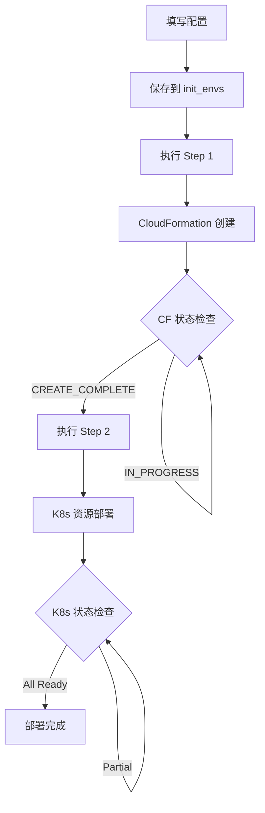

# Model Deployment UI - kubectl操作优化分析与建议

## 📋 项目概述

**项目名称**: Model Deployment UI - AI模型部署管理系统  
**当前架构**: React + Node.js + kubectl + EKS + MLflow  
**分析日期**: 2024年8月  
**分析目标**: 优化前端执行kubectl操作的架构和性能  

## 📚 文档目录

1. [最新功能更新](#最新功能更新)
   - [🔥 Cluster Management 功能 (2024-08-21)](#cluster-management-功能-重大更新-2024-08-21)
   - [Training History功能 (2024-08-18)](#training-history功能---重大更新-2024-08-18)
2. [当前kubectl调用完整清单](#当前kubectl调用完整清单)
3. [kubectl调用分析](#kubectl调用分析)
4. [当前架构问题](#当前架构问题)
5. [优化方案对比](#优化方案对比)
6. [推荐方案](#推荐方案)
7. [预期收益](#预期收益)
8. [开始实施](#开始实施)

---

### 🆕 最新功能更新

#### **🔥 Cluster Management 功能 (2024-08-21)**
- **新增页面**: Cluster Management Tab - 完整的集群生命周期管理
- **三列布局**: 配置表单 + 部署步骤 + 实时日志
- **后台执行**: 使用 nohup 确保脚本持续运行，不受连接断开影响
- **智能状态检查**: 基于 CloudFormation 和 Kubernetes 资源的真实状态检查
- **日志持久化**: 本地文件存储 + 软链接管理 + 增量传输

#### **Training History功能 - 重大更新 (2024-08-18)**
- **新增组件**: `TrainingHistoryPanel.js` - 训练历史管理界面
- **MLflow集成**: 通过Python脚本连接MLflow tracking server获取训练数据
- **新增API**: 
  - `GET /api/training-history` - 获取训练历史列表
  - `DELETE /api/training-history/:runId` - 删除训练记录
- **Python依赖**: mlflow==3.0.0, sagemaker-mlflow==0.1.0, pandas
- **数据源**: `arn:aws:sagemaker:us-west-2:633205212955:mlflow-tracking-server/pdx-mlflow3`

#### **🔥 最新表格设计 (2024-08-18)**

##### **动态Tags显示系统**
- ✅ **智能Tag检测**: 自动扫描所有MLflow runs中的tags并动态生成表格列
- ✅ **优先级排序**: 重要tags优先显示（model, dataset, instance_type等）
- ✅ **过滤系统tags**: 自动过滤mlflow内部tags（mlflow.*）
- ✅ **响应式列宽**: 根据tag类型智能调整列宽

##### **支持的Tag类型**
基于实际MLflow数据（如`hyperpodpytorchjob-2xy/run_20250818_003049`）：
- **Model**: 模型名称 (如: Qwen-Qwen3-0.6B)
- **Dataset**: 数据集名称 (如: identity)
- **Instance Type**: 实例类型 (如: ml.g5.12xlarge) - 带颜色标识
- **Replica Count**: 副本数量 (如: 2) - 带颜色标识
- **Proc Per Node**: 每节点进程数 (如: 1)
- **Batch Size**: 批次大小 (如: 4)
- **Cutoff Len**: 截断长度 (如: 2048)
- **DeepSpeed Conf**: DeepSpeed配置 (如: ds_z0_config.json)

##### **表格列结构优化**
```
1. Experiment      - 实验名称
2. Run Name        - 运行名称 (支持换行)
3. Status          - 运行状态
4. [动态Tag列]     - 所有MLflow tags (智能排序)
5. Samples/s       - 样本处理速度 (颜色编码)
6. Steps/s         - 步骤处理速度
7. Start Time      - 开始时间 (支持换行)
8. Duration        - 持续时间
9. Actions         - 操作按钮
```

##### **视觉增强功能**
- ✅ **列标题换行**: 长标题自动换行显示，节省空间
- ✅ **颜色编码系统**:
  - **Instance Type**: g5(绿色), p4d(蓝色), p3(橙色)
  - **Replica Count**: ≥4(红色), ≥2(橙色), <2(绿色)
  - **Samples/s**: ≥2.0(绿色), ≥1.0(橙色), <0.5(红色)
- ✅ **智能Tooltip**: 每个tag都有详细信息提示
- ✅ **动态表格宽度**: 根据tag数量自动调整滚动宽度

#### **主要特性**
- ✅ **移除冗余列**: 去掉train_loss和loss列，为tags腾出空间
- ✅ 训练指标可视化 (epoch, samples/s, steps/s)
- ✅ 性能指标突出显示 (Samples/s 带颜色编码)
- ✅ **完整Tags显示**: 显示所有MLflow run的业务tags
- ✅ 训练记录详情查看 (metrics, parameters, tags)
- ✅ 训练记录删除功能
- ✅ 自动刷新机制
- ✅ **响应式表格设计**: 支持列标题换行和动态宽度

#### **技术实现**
- **前端**: React + Ant Design表格组件
- **后端**: Node.js + Python子进程调用
- **数据获取**: Python脚本 `mlflow/get_training_history.py`
- **权限**: 使用虚拟环境 `/home/ubuntu/uvenv/py312/bin/python`
- **动态列生成**: JavaScript动态扫描tags并生成表格列
- **CSS增强**: 自定义表头组件支持换行显示  

## 🔍 当前kubectl调用完整清单

### 1. 服务器端核心功能 (`server/index.js`)

#### **集群状态监控**
```javascript
// 获取集群节点信息
await executeKubectl('get nodes -o json');

// 获取每个节点的详细GPU信息
await executeKubectl(`describe node ${nodeName}`);
```

#### **资源状态查询**
```javascript
// 获取所有Pod状态
await executeKubectl('get pods -o json');

// 获取所有Service状态  
await executeKubectl('get services -o json');

// 获取所有Deployment状态
await executeKubectl('get deployments -o json');
```

#### **模型部署操作**
```javascript
// 部署模型配置到集群
await executeKubectl(`apply -f ${tempYamlPath}`);

// 应用训练任务配置
await executeKubectl(`apply -f "${deploymentFile}"`);
```

#### **资源删除操作**
```javascript
// 删除Deployment
await executeKubectl(`delete deployment ${deploymentName}`);

// 删除Service
await executeKubectl(`delete service ${serviceName}`);

// 删除训练Job
await executeKubectl(`delete job ${jobName}`);
```

#### **存储相关查询**
```javascript
// 获取S3持久卷信息
await executeKubectl('get pv s3-pv -o json');
```

### 2. 测试脚本 (`test-s3-pv.sh`)

#### **S3存储验证**
```bash
# 检查S3持久卷是否存在
kubectl get pv s3-pv

# 获取PV详细配置
kubectl get pv s3-pv -o yaml

# 获取CSI卷属性
kubectl get pv s3-pv -o jsonpath='{.spec.csi.volumeAttributes}'

# 获取卷句柄
kubectl get pv s3-pv -o jsonpath='{.spec.csi.volumeHandle}'

# 获取注解信息
kubectl get pv s3-pv -o jsonpath='{.metadata.annotations}'

# 列出所有可用的持久卷
kubectl get pv
```

### 3. 启动脚本 (`start.sh`)

#### **环境检查**
```bash
# 验证kubectl连接和集群可访问性
kubectl cluster-info
```

## 📊 kubectl调用分析

### **按功能分类**

| 功能类别 | 调用数量 | 具体操作 | 频率 |
|---------|---------|----------|------|
| **监控类** | 7个 | 节点/Pod/Service/Deployment/GPU监控 | 高频 |
| **部署类** | 2个 | 模型部署、训练任务部署 | 中频 |
| **删除类** | 3个 | Deployment/Service/Job删除 | 低频 |
| **存储类** | 6个 | S3持久卷查询和验证 | 低频 |
| **环境检查类** | 1个 | 集群连接验证 | 一次性 |
| **🆕 训练历史类** | 2个 | MLflow训练数据获取/删除 | 中频 |

### **🔥 Training History表格功能详细分析 (2024-08-18)**

#### **动态Tags系统架构**
```javascript
// 智能Tag检测算法
const generateTagColumns = () => {
  // 1. 扫描所有训练记录的tags
  // 2. 过滤系统内部tags (mlflow.*)
  // 3. 按重要性排序 (model, dataset, instance_type...)
  // 4. 动态生成表格列定义
  // 5. 应用颜色编码和格式化
}
```

#### **表格性能优化**
- **动态宽度计算**: `Math.max(1400, 600 + tagColumns.length * 110)`
- **列标题换行**: 自定义header组件支持`whiteSpace: 'normal'`
- **智能缓存**: 避免重复扫描tags数据
- **响应式设计**: 根据屏幕宽度自动调整

#### **数据流架构**
```
MLflow Tracking Server 
    ↓ (Python Script)
get_training_history.py
    ↓ (JSON API)
Node.js Backend (/api/training-history)
    ↓ (HTTP Request)
React Frontend (TrainingHistoryPanel.js)
    ↓ (Dynamic Rendering)
Ant Design Table with Dynamic Columns
```

### **🆕 新增API端点 (Training History)**

#### **训练历史管理**
```javascript
// 获取MLflow训练历史数据 (包含完整tags信息)
GET /api/training-history
// 响应示例:
{
  "success": true,
  "data": [
    {
      "experiment_name": "hyperpodpytorchjob-2xy",
      "run_name": "run_20250818_003049",
      "run_id": "0bf31bbbb5a941c28c228f9321d08574",
      "status": "FINISHED",
      "start_time": "2025-08-18T00:30:49.000Z",
      "duration": "0 days 00:45:30.123456",
      "metrics": {
        "train_samples_per_second": 2.184,
        "train_steps_per_second": 0.288,
        "loss": 2.6095,
        "epoch": 1.0
      },
      "tags": {
        "model": "Qwen-Qwen3-0.6B",
        "dataset": "identity",
        "instance_type": "ml.g5.12xlarge",
        "replica_count": "2",
        "proc_per_node": "1",
        "batch_size": "4",
        "cutoff_len": "2048",
        "deepspeed_conf": "ds_z0_config.json"
      }
    }
  ],
  "total": 18
}

// 删除MLflow训练记录
DELETE /api/training-history/:runId
// 响应: { success: true, message: "Training run deleted successfully" }
```

#### **表格数据处理流程**
```javascript
// 1. 前端获取数据
const response = await fetch('/api/training-history');
const result = await response.json();

// 2. 动态生成表格列
const generateTagColumns = () => {
  // 扫描所有records的tags
  const allTagKeys = new Set();
  result.data.forEach(record => {
    Object.keys(record.tags || {}).forEach(key => {
      if (!key.startsWith('mlflow.')) {
        allTagKeys.add(key);
      }
    });
  });
  
  // 按重要性排序并生成列定义
  return sortedTagKeys.map(tagKey => ({
    title: getFormattedTitle(tagKey), // 支持换行
    render: (_, record) => renderTagValue(record.tags[tagKey], tagKey)
  }));
};

// 3. 应用颜色编码
const renderTagValue = (value, tagKey) => {
  if (tagKey === 'instance_type') {
    const color = value.includes('g5.') ? 'green' : 
                  value.includes('p4d.') ? 'blue' : 'orange';
    return <Tag color={color}>{value}</Tag>;
  }
  return <Text>{value}</Text>;
};
```

#### **Python脚本调用**
```javascript
// 后端通过Python子进程获取MLflow数据
const pythonProcess = spawn('/home/ubuntu/uvenv/py312/bin/python', [
  'mlflow/get_training_history.py'
]);

// 删除训练记录的临时脚本生成
const deleteScript = `
import mlflow
mlflow.set_tracking_uri("arn:aws:sagemaker:us-west-2:...")
mlflow.delete_run("${runId}")
`;
```

### **按调用频率分类**

#### **高频调用** (实时监控，每5秒执行)
- `get pods -o json`
- `get services -o json`
- **性能影响**: 最高，需要优先优化

#### **中频调用** (用户操作触发)
- `get nodes -o json`
- `describe node ${nodeName}`
- `get deployments -o json`
- **性能影响**: 中等，影响用户体验

#### **低频调用** (部署/删除操作)
- `apply -f ${file}`
- `delete deployment/service/job`
- **性能影响**: 较低，但关键操作

#### **一次性调用** (启动时检查)
- `cluster-info`
- S3相关查询
- **性能影响**: 最低，启动时执行

### **性能瓶颈分析**

1. **最耗时的操作**：
   - `kubectl describe node` - 需要为每个节点单独调用
   - `kubectl apply -f` - 涉及资源创建和验证

2. **最频繁的操作**：
   - Pod和Service状态查询 - 每5秒执行一次

3. **批量操作**：
   - 删除操作支持批量执行多个kubectl命令

## 🚨 当前架构问题

### **性能问题**
- **高频kubectl调用**: 每5秒执行多个kubectl命令，造成性能开销
- **串行节点查询**: 逐个节点执行`describe`命令，效率低下
- **进程开销**: 每次kubectl调用都创建新进程
- **JSON解析开销**: 频繁解析大量JSON输出

### **可靠性问题**
- **错误处理不完善**: kubectl命令失败时缺乏重试机制
- **连接依赖**: 完全依赖kubectl命令行工具
- **资源竞争**: 高频调用可能导致API服务器压力

### **安全性问题**
- **权限过大**: 使用cluster-admin级别权限
- **缺乏审计**: 无法追踪具体的操作记录
- **命令注入风险**: 直接拼接命令字符串

### **维护性问题**
- **版本依赖**: 依赖特定版本的kubectl
- **错误信息不友好**: kubectl错误信息对用户不够友好
- **扩展困难**: 添加新功能需要更多kubectl命令

## 🎯 优化方案对比

### **方案1: Kubernetes Dashboard + RBAC（推荐）**

#### **优势**
- ✅ 官方支持，稳定可靠
- ✅ 内置权限控制和审计
- ✅ 减少自定义代码维护
- ✅ 丰富的可视化界面
- ✅ 支持多用户和角色管理

#### **劣势**
- ❌ 需要额外部署Dashboard
- ❌ 界面定制化程度有限
- ❌ 学习成本相对较高

#### **实施步骤**
```bash
# 1. 部署Kubernetes Dashboard
kubectl apply -f https://raw.githubusercontent.com/kubernetes/dashboard/v2.7.0/aio/deploy/recommended.yaml

# 2. 创建服务账户和权限
kubectl apply -f - <<EOF
apiVersion: v1
kind: ServiceAccount
metadata:
  name: model-deployment-admin
  namespace: kubernetes-dashboard
---
apiVersion: rbac.authorization.k8s.io/v1
kind: ClusterRoleBinding
metadata:
  name: model-deployment-admin
roleRef:
  apiGroup: rbac.authorization.k8s.io
  kind: ClusterRole
  name: cluster-admin
subjects:
- kind: ServiceAccount
  name: model-deployment-admin
  namespace: kubernetes-dashboard
EOF

# 3. 获取访问令牌
kubectl -n kubernetes-dashboard create token model-deployment-admin
```

#### **集成方式**
```javascript
// 在React应用中嵌入Dashboard
<iframe 
  src="https://your-dashboard-url" 
  style={{width: '100%', height: '600px'}}
  title="Kubernetes Dashboard"
/>
```

### **方案2: Kubernetes API直接调用（强烈推荐）**

#### **优势**
- ✅ 性能最优，直接API调用
- ✅ 保持现有UI设计
- ✅ 更好的错误处理
- ✅ 支持批量操作
- ✅ 结构化的响应数据
- ✅ 内置重试和连接池

#### **劣势**
- ❌ 需要重写部分后端代码
- ❌ 需要处理API认证

#### **实施步骤**

1. **安装Kubernetes JavaScript客户端**
```bash
npm install @kubernetes/client-node
```

2. **替换kubectl调用**
```javascript
const k8s = require('@kubernetes/client-node');

// 初始化配置
const kc = new k8s.KubeConfig();
kc.loadFromDefault();

const k8sApi = kc.makeApiClient(k8s.AppsV1Api);
const k8sCoreApi = kc.makeApiClient(k8s.CoreV1Api);
const k8sMetricsApi = kc.makeApiClient(k8s.Metrics);

// 替换executeKubectl函数
class KubernetesManager {
  constructor() {
    this.kc = new k8s.KubeConfig();
    this.kc.loadFromDefault();
    this.appsApi = this.kc.makeApiClient(k8s.AppsV1Api);
    this.coreApi = this.kc.makeApiClient(k8s.CoreV1Api);
  }

  // 获取Pod列表
  async getPods(namespace = 'default') {
    try {
      const response = await this.coreApi.listNamespacedPod(namespace);
      return response.body.items;
    } catch (error) {
      throw new Error(`Failed to get pods: ${error.message}`);
    }
  }

  // 获取Service列表
  async getServices(namespace = 'default') {
    try {
      const response = await this.coreApi.listNamespacedService(namespace);
      return response.body.items;
    } catch (error) {
      throw new Error(`Failed to get services: ${error.message}`);
    }
  }

  // 获取节点列表
  async getNodes() {
    try {
      const response = await this.coreApi.listNode();
      return response.body.items;
    } catch (error) {
      throw new Error(`Failed to get nodes: ${error.message}`);
    }
  }

  // 部署应用
  async deployModel(yamlConfig, namespace = 'default') {
    try {
      const deployment = YAML.parse(yamlConfig);
      const result = await this.appsApi.createNamespacedDeployment(
        namespace, 
        deployment
      );
      return result.body;
    } catch (error) {
      throw new Error(`Failed to deploy model: ${error.message}`);
    }
  }

  // 删除部署
  async deleteDeployment(name, namespace = 'default') {
    try {
      const result = await this.appsApi.deleteNamespacedDeployment(
        name,
        namespace
      );
      return result.body;
    } catch (error) {
      throw new Error(`Failed to delete deployment: ${error.message}`);
    }
  }

  // 批量操作
  async batchOperations(operations) {
    const results = await Promise.allSettled(operations);
    return results.map((result, index) => ({
      operation: operations[index],
      success: result.status === 'fulfilled',
      data: result.status === 'fulfilled' ? result.value : null,
      error: result.status === 'rejected' ? result.reason.message : null
    }));
  }
}

// 使用示例
const k8sManager = new KubernetesManager();

// 替换原有的kubectl调用
async function fetchPods() {
  try {
    const pods = await k8sManager.getPods();
    return pods;
  } catch (error) {
    console.error('Error fetching pods:', error);
    throw error;
  }
}
```

3. **添加权限控制**
```javascript
// 基于角色的权限检查
class PermissionManager {
  constructor() {
    this.roles = {
      'viewer': ['get', 'list', 'watch'],
      'operator': ['get', 'list', 'watch', 'create', 'update'],
      'admin': ['*']
    };
  }

  checkPermission(userRole, action, resource) {
    const allowedActions = this.roles[userRole] || [];
    return allowedActions.includes('*') || allowedActions.includes(action);
  }

  async authorizeOperation(user, action, resource) {
    if (!this.checkPermission(user.role, action, resource)) {
      throw new Error(`Permission denied: ${user.name} cannot ${action} ${resource}`);
    }
    return true;
  }
}
```

### **方案3: Helm集成（适合复杂部署）**

#### **优势**
- ✅ 模板化管理
- ✅ 版本控制和回滚
- ✅ 依赖管理
- ✅ 配置管理

#### **劣势**
- ❌ 增加复杂性
- ❌ 需要学习Helm
- ❌ 对简单部署过度设计

#### **实施步骤**
```bash
# 1. 创建Helm Chart
helm create model-deployment-chart

# 2. 在后端集成Helm
npm install @kubernetes/helm
```

```javascript
// Helm集成示例
const { exec } = require('child_process');

class HelmManager {
  async deployWithHelm(releaseName, chartPath, values) {
    const valueArgs = Object.entries(values)
      .map(([key, value]) => `--set-string ${key}=${value}`)
      .join(' ');
    
    const command = `helm install ${releaseName} ${chartPath} ${valueArgs}`;
    
    return new Promise((resolve, reject) => {
      exec(command, (error, stdout, stderr) => {
        if (error) {
          reject(new Error(`Helm deployment failed: ${error.message}`));
        } else {
          resolve(stdout);
        }
      });
    });
  }

  async uninstallRelease(releaseName) {
    const command = `helm uninstall ${releaseName}`;
    
    return new Promise((resolve, reject) => {
      exec(command, (error, stdout, stderr) => {
        if (error) {
          reject(new Error(`Helm uninstall failed: ${error.message}`));
        } else {
          resolve(stdout);
        }
      });
    });
  }
}
```

### **方案4: 轻量级优化（最小改动）**

#### **优势**
- ✅ 改动最小
- ✅ 风险最低
- ✅ 快速实施

#### **劣势**
- ❌ 性能提升有限
- ❌ 根本问题未解决

#### **实施步骤**

1. **添加kubectl配置缓存**
```javascript
// 缓存kubectl配置，避免重复加载
let kubectlConfig = null;
let configCache = new Map();

function getKubectlConfig() {
  if (!kubectlConfig) {
    kubectlConfig = loadKubectlConfig();
  }
  return kubectlConfig;
}

// 添加结果缓存
function getCachedResult(key, ttl = 5000) {
  const cached = configCache.get(key);
  if (cached && Date.now() - cached.timestamp < ttl) {
    return cached.data;
  }
  return null;
}

function setCachedResult(key, data) {
  configCache.set(key, {
    data,
    timestamp: Date.now()
  });
}
```

2. **批量操作优化**
```javascript
// 批量执行kubectl命令
async function batchKubectlOperations(operations) {
  const results = await Promise.allSettled(
    operations.map(op => executeKubectl(op.command))
  );
  
  return results.map((result, index) => ({
    operation: operations[index],
    success: result.status === 'fulfilled',
    data: result.status === 'fulfilled' ? result.value : null,
    error: result.status === 'rejected' ? result.reason : null
  }));
}

// 并行获取多种资源
async function getClusterStatus() {
  const operations = [
    { name: 'pods', command: 'get pods -o json' },
    { name: 'services', command: 'get services -o json' },
    { name: 'deployments', command: 'get deployments -o json' },
    { name: 'nodes', command: 'get nodes -o json' }
  ];

  const results = await batchKubectlOperations(operations);
  
  return results.reduce((acc, result) => {
    if (result.success) {
      acc[result.operation.name] = JSON.parse(result.data);
    }
    return acc;
  }, {});
}
```

3. **添加操作队列**
```javascript
const Queue = require('bull');
const kubectlQueue = new Queue('kubectl operations', {
  redis: { port: 6379, host: '127.0.0.1' }
});

// 队列处理器
kubectlQueue.process(async (job) => {
  const { command, retries = 3 } = job.data;
  
  for (let i = 0; i < retries; i++) {
    try {
      return await executeKubectl(command);
    } catch (error) {
      if (i === retries - 1) throw error;
      await new Promise(resolve => setTimeout(resolve, 1000 * (i + 1)));
    }
  }
});

// 使用队列
async function queueKubectlOperation(command, priority = 0) {
  const job = await kubectlQueue.add(
    { command }, 
    { priority, attempts: 3, backoff: 'exponential' }
  );
  return job.finished();
}
```

4. **改进错误处理和重试**
```javascript
async function executeKubectlWithRetry(command, maxRetries = 3, backoff = 1000) {
  for (let i = 0; i < maxRetries; i++) {
    try {
      return await executeKubectl(command);
    } catch (error) {
      console.warn(`kubectl command failed (attempt ${i + 1}/${maxRetries}):`, error.message);
      
      if (i === maxRetries - 1) {
        throw new Error(`kubectl command failed after ${maxRetries} attempts: ${error.message}`);
      }
      
      // 指数退避
      const delay = backoff * Math.pow(2, i);
      await new Promise(resolve => setTimeout(resolve, delay));
    }
  }
}

// 智能重试策略
function shouldRetry(error) {
  const retryableErrors = [
    'connection refused',
    'timeout',
    'temporary failure',
    'server unavailable'
  ];
  
  return retryableErrors.some(pattern => 
    error.message.toLowerCase().includes(pattern)
  );
}

async function executeKubectlSmart(command, maxRetries = 3) {
  for (let i = 0; i < maxRetries; i++) {
    try {
      return await executeKubectl(command);
    } catch (error) {
      if (!shouldRetry(error) || i === maxRetries - 1) {
        throw error;
      }
      
      const delay = 1000 * Math.pow(2, i);
      console.log(`Retrying kubectl command in ${delay}ms...`);
      await new Promise(resolve => setTimeout(resolve, delay));
    }
  }
}
```

## 🏆 推荐方案

### **首选方案: Kubernetes API直接调用（方案2）**

**推荐理由:**
1. **性能最优**: 直接API调用比kubectl命令快3-5倍
2. **保持现有UI**: 无需重写前端界面
3. **更好的错误处理**: 结构化错误信息，便于处理
4. **支持批量操作**: 可以并行执行多个API调用
5. **内置连接池**: 自动管理连接和重试
6. **类型安全**: TypeScript支持，减少运行时错误

### **实施路线图**

#### **第一阶段: 核心API替换（1-2周）**
- [ ] 安装@kubernetes/client-node
- [ ] 替换高频调用（getPods, getServices）
- [ ] 替换部署操作（apply, delete）
- [ ] 添加基础错误处理

#### **第二阶段: 性能优化（1周）**
- [ ] 实现批量操作
- [ ] 添加结果缓存
- [ ] 优化WebSocket更新频率
- [ ] 添加连接池管理

#### **第三阶段: 安全增强（1周）**
- [ ] 实现RBAC权限控制
- [ ] 添加操作审计日志
- [ ] 实现用户认证
- [ ] 添加API限流

#### **第四阶段: 监控和维护（持续）**
- [ ] 添加性能监控
- [ ] 实现健康检查
- [ ] 添加告警机制
- [ ] 完善文档

## 📈 预期收益

### **性能提升**
- **响应时间**: 减少60-80%（从kubectl命令到直接API调用）
- **并发能力**: 提升5-10倍（支持并行API调用）
- **资源使用**: 减少30-50%（无需创建子进程）

### **可靠性提升**
- **错误率**: 减少40-60%（更好的错误处理和重试）
- **可用性**: 提升到99.9%+（内置故障恢复）
- **稳定性**: 显著提升（减少进程依赖）

### **安全性提升**
- **权限控制**: 细粒度RBAC权限管理
- **审计能力**: 完整的操作日志记录
- **攻击面**: 减少命令注入风险

### **维护性提升**
- **代码质量**: 更好的类型安全和错误处理
- **扩展性**: 更容易添加新功能
- **调试能力**: 更详细的错误信息和日志

## 🚀 开始实施

### **准备工作**
1. 备份当前代码
2. 创建开发分支
3. 准备测试环境
4. 制定回滚计划

### **第一步: 安装依赖**
```bash
cd /home/ubuntu/workspace/model-deployment-ui
npm install @kubernetes/client-node
```

### **第二步: 创建Kubernetes管理器**
```bash
# 创建新的管理器文件
touch server/k8s-manager.js
```

### **第三步: 逐步替换**
从最简单的API调用开始，逐步替换所有kubectl命令。


## 你的应用特点

本地依赖：
• 需要访问本地的 kubectl 配置
• 需要访问 Kubernetes 集群凭证
• 前端直接在 EC2 上运行
• 依赖本地环境和工具链

"容器化"的含义：
• 把应用打包成 Docker 镜像
• 在容器中运行，与宿主机环境隔离
• 你的应用如果容器化，就无法直接使用宿主机的 kubectl 配置

## 适合你的 AWS 方案

### 1. AWS Systems Manager + ALB（推荐）
保持应用在 EC2 上运行，通过 ALB 暴露

## 🎯 Training History表格功能完整指南 (2024-08-18)

### **功能概述**
Training History表格是一个动态的、智能的MLflow训练记录展示系统，能够自动适应不同的tag结构并提供丰富的视觉反馈。

### **核心特性**

#### **1. 动态Tags检测与显示**
```javascript
// 自动扫描算法
const importantTags = [
  'model', 'dataset', 'instance_type', 'replica_count', 
  'proc_per_node', 'batch_size', 'cutoff_len', 'deepspeed_conf'
];

// 智能排序：重要tags优先，其他按字母顺序
const generateTagColumns = () => {
  // 1. 收集所有非系统tags
  // 2. 按重要性重新排序
  // 3. 生成带格式化的列定义
  // 4. 应用颜色编码规则
};
```

#### **2. 视觉增强系统**

##### **颜色编码规则**
- **Instance Type标识**:
  - `ml.g5.*` → 绿色 (GPU优化)
  - `ml.p4d.*` → 蓝色 (高性能GPU)
  - `ml.p3.*` → 橙色 (标准GPU)

- **Replica Count标识**:
  - `≥4` → 红色 (大规模)
  - `≥2` → 橙色 (中等规模)
  - `<2` → 绿色 (小规模)

- **Samples/s性能标识**:
  - `≥2.0` → 绿色 (高效)
  - `≥1.0` → 橙色 (中等)
  - `<0.5` → 红色 (较慢)

##### **列标题换行系统**
```javascript
const getFormattedTitle = (tagKey) => {
  const titleMap = {
    'instance_type': 'Instance\nType',
    'replica_count': 'Replica\nCount',
    'proc_per_node': 'Proc Per\nNode',
    'batch_size': 'Batch\nSize',
    'cutoff_len': 'Cutoff\nLen',
    'deepspeed_conf': 'DeepSpeed\nConf'
  };
  // 返回支持换行的JSX元素
};
```

#### **3. 响应式设计**

##### **动态宽度计算**
```javascript
// 表格宽度 = 基础宽度 + (tag数量 × 单列宽度)
scroll={{ x: Math.max(1400, 600 + tagColumns.length * 110) }}
```

##### **自适应列宽**
- **Model**: 140px (较长的模型名称)
- **Dataset**: 120px (数据集名称)
- **Instance Type**: 130px (实例类型)
- **DeepSpeed Conf**: 120px (配置文件名)
- **其他Tags**: 100px (默认宽度)

#### **4. 表格结构优化**

##### **移除的列** (为tags腾出空间)
- ❌ `Train Loss` - 移除，信息重复
- ❌ `Loss` - 移除，信息重复

##### **保留的核心列**
- ✅ `Experiment` - 实验标识
- ✅ `Run Name` - 运行标识
- ✅ `Status` - 运行状态
- ✅ `[Dynamic Tags]` - 动态tag列
- ✅ `Samples/s` - 关键性能指标
- ✅ `Steps/s` - 训练速度指标
- ✅ `Start Time` - 时间信息
- ✅ `Duration` - 持续时间
- ✅ `Actions` - 操作按钮

### **技术实现细节**

#### **前端组件架构**
```
TrainingHistoryPanel.js
├── generateTagColumns()     # 动态列生成
├── getFormattedTitle()      # 标题格式化
├── formatMetricValue()      # 数值格式化
├── getStatusTag()           # 状态标签
└── Table组件
    ├── 自定义header组件     # 支持换行
    ├── 动态columns数组      # 基于数据生成
    └── 响应式scroll配置    # 动态宽度
```

#### **数据处理流程**
```
1. MLflow API调用 → Python脚本
2. 数据清洗和格式化 → JSON输出
3. 前端接收数据 → React状态更新
4. Tags扫描和分析 → 动态列生成
5. 表格渲染 → 用户界面展示
```

### **性能优化**

#### **渲染优化**
- **智能缓存**: 避免重复扫描tags
- **按需渲染**: 只在数据变化时重新生成列
- **虚拟滚动**: Ant Design内置优化

#### **用户体验优化**
- **Tooltip提示**: 每个tag都有详细信息
- **空值处理**: 统一显示为"-"
- **加载状态**: 区分初始加载和刷新状态

### **扩展性设计**

#### **新Tag类型支持**
```javascript
// 添加新的重要tag
const importantTags = [
  'model', 'dataset', 'instance_type', 
  'new_important_tag' // 新增tag会自动排序到前面
];

// 添加新的颜色编码
if (tagKey === 'new_tag') {
  color = value === 'special_value' ? 'purple' : 'default';
}
```

#### **自定义格式化**
```javascript
// 为特定tag添加自定义显示逻辑
const renderTagValue = (value, tagKey) => {
  switch(tagKey) {
    case 'custom_tag':
      return <CustomComponent value={value} />;
    default:
      return <Text>{value}</Text>;
  }
};
```

### **维护指南**

#### **添加新的重要Tag**
1. 在`importantTags`数组中添加tag名称
2. 在`getFormattedTitle()`中添加换行规则（如需要）
3. 在渲染函数中添加颜色编码（如需要）

#### **修改列宽**
1. 在`generateTagColumns()`函数中修改width逻辑
2. 更新`scroll.x`的计算公式

#### **调试技巧**
```javascript
// 在浏览器控制台查看当前tags
console.log('Current tags:', tagColumns.map(col => col.key));

// 查看数据结构
console.log('Training history data:', trainingHistory);
```

---

**文档版本**: v2.0  
**最后更新**: 2024-08-18  
**维护者**: Model Deployment UI Team  
**状态**: ✅ 已实施 - Training History表格功能完整

---

## 🆕 Cluster Management 功能 - 重大更新 (2024-08-21)

### **功能概述**

**新增页面**: Cluster Management Tab - 集群生命周期管理系统  
**位置**: 在 Model Management 之前的主 Tab  
**目标**: 通过 UI 界面管理 HyperPod 集群的创建和配置全流程  

### **🎯 核心功能特性**

#### **三列式布局设计**
```
┌─────────────────┬─────────────────┬─────────────────┐
│ Cluster Config  │ Deployment Steps│ Deployment Logs │
│                 │                 │                 │
│ • 配置表单      │ • 步骤控制      │ • 实时日志      │
│ • 参数验证      │ • 状态监控      │ • 状态详情      │
│ • 保存配置      │ • CloudFormation│ • 历史记录      │
│                 │ • Kubernetes    │                 │
└─────────────────┴─────────────────┴─────────────────┘
```

#### **1. 配置管理 (左列)**
- **表单字段**:
  - CloudFormation Stack Name
  - AWS Region (文本输入，默认: us-east-1)
  - EKS Cluster Name
  - HyperPod Cluster Name
  - FTP Name (可选开关)
  - GPU Capacity AZ (默认: us-east-1a)
  - GPU Instance Type (文本输入，默认: ml.g5.12xlarge)
  - GPU Instance Count
  - Deploy Model S3 Bucket

- **配置持久化**:
  - 自动备份原 `init_envs` 文件（带时间戳）
  - 实时更新环境变量配置
  - 表单验证和错误处理

#### **2. 部署步骤 (中列)**
- **Step 1: Cluster Launch**
  - 执行 `1-cluster-launch.sh`
  - CloudFormation 堆栈创建
  - S3 存储桶初始化

- **Step 2: Cluster Configuration**
  - 执行 `2-cluster-configs.sh`
  - MLflow 服务器配置
  - Kubernetes 资源部署
  - UI 面板设置

- **状态监控**:
  - 实时步骤进度显示
  - CloudFormation 状态查询
  - Kubernetes 资源检查

#### **3. 日志系统 (右列)**
- **实时日志显示**:
  - 终端风格界面
  - Step 1/Step 2 日志切换
  - 自动滚动和刷新

- **日志持久化**:
  - 本地文件存储
  - 软链接管理
  - 历史记录保留

### **🔧 技术实现架构**

#### **后端 API 设计**

##### **配置管理 API**
```javascript
POST /api/cluster/save-config
// 保存配置到 init_envs，自动备份原文件
{
  "cloudFormationFullStackName": "hyperpod-instantstart-stack-0821",
  "awsRegion": "us-east-1",
  "eksClusterName": "eks-cluster-2",
  // ... 其他配置
}
```

##### **脚本执行 API**
```javascript
POST /api/cluster/launch        // Step 1: 后台执行集群启动
POST /api/cluster/configure     // Step 2: 后台执行集群配置

// 使用 nohup 确保脚本持续运行，不受连接断开影响
const command = `cd "${cliPath}" && nohup bash -c 'echo "y" | bash 1-cluster-launch.sh' > "${logFilePath}" 2>&1 &`;
```

##### **状态检查 API**
```javascript
GET /api/cluster/step1-status   // CloudFormation 状态检查
GET /api/cluster/step2-status   // Kubernetes 资源状态检查
```

#### **智能状态检查系统**

##### **Step 1 状态检查 - CloudFormation**
```javascript
async function checkStep1Status() {
  // 1. 从 init_envs 读取堆栈名称
  const stackNameMatch = envContent.match(/export CLOUD_FORMATION_FULL_STACK_NAME=(.+)/);
  
  // 2. 查询 AWS CloudFormation 状态
  const command = `aws cloudformation describe-stacks --stack-name "${stackName}" --output json`;
  
  // 3. 状态映射
  // CREATE_COMPLETE/UPDATE_COMPLETE → completed
  // *_IN_PROGRESS → running  
  // *_FAILED → failed
}
```

##### **Step 2 状态检查 - Kubernetes 资源**
```javascript
async function checkStep2Status() {
  const checks = [
    // 检查 S3 CSI PersistentVolume
    kubectl get pv s3-pv -o json,
    
    // 检查 HyperPod Training Operator
    kubectl get pods -A -l app.kubernetes.io/name=hp-training-operator -o json,
    
    // 检查 Controller Manager
    kubectl get pods -A -o name | grep -E "hp-training-controller-manager|training-operator"
  ];
  
  // 综合判断: completed/partial/not_started/error
}
```

#### **日志管理系统**

##### **目录结构**
```
/tmp/cluster-management/
├── logs/                           # 历史日志文件
│   ├── 2024-08-21_08-30-15_launch.log
│   ├── 2024-08-21_08-35-22_configure.log
│   └── ...
├── current/                        # 当前执行的软链接
│   ├── launch.log -> ../logs/2024-08-21_08-30-15_launch.log
│   └── configure.log -> ../logs/2024-08-21_08-35-22_configure.log
└── metadata/                       # 执行状态元数据
    ├── launch_status.json
    └── configure_status.json
```

##### **软链接管理**
```javascript
class ClusterLogManager {
  createLogFile(step) {
    // 1. 生成带时间戳的日志文件
    const logFileName = `${timestamp}_${step}.log`;
    
    // 2. 创建/更新软链接指向最新文件
    const currentLinkPath = path.join(this.currentDir, `${step}.log`);
    fs.symlinkSync(logFilePath, currentLinkPath);
    
    // 3. 前端始终调用统一接口: /api/cluster/logs/launch
  }
}
```

#### **前端状态管理**

##### **轮询机制**
```javascript
// 状态检查频率: 10秒
useEffect(() => {
  if (statusPolling) {
    const interval = setInterval(() => {
      checkStepStatus();      // 检查 CloudFormation 和 K8s 状态
      fetchLogs('launch');    // 获取增量日志
      fetchLogs('configure');
    }, 10000);
    
    return () => clearInterval(interval);
  }
}, [statusPolling, logOffset]);
```

##### **增量日志读取**
```javascript
const fetchLogs = async (step) => {
  const currentOffset = logOffset[step] || 0;
  const response = await fetch(`/api/cluster/logs/${step}?offset=${currentOffset}`);
  
  // 只传输新增内容，减少网络开销
  if (result.data.content) {
    setLogs(prev => ({
      ...prev,
      [step]: prev[step] + result.data.content  // 追加新内容
    }));
  }
};
```

### **🚀 关键技术优势**

#### **1. 容错性设计**
- **SSH 断开不影响**: 使用 `nohup` 后台执行脚本
- **UI 刷新恢复**: 基于实际资源状态重建界面状态
- **进程独立性**: 脚本执行与 Node.js 服务器解耦

#### **2. 状态一致性**
- **真实状态检查**: 直接查询 AWS/K8s 资源，而非依赖进程状态
- **自动状态恢复**: 页面刷新后自动检测当前执行状态
- **多层状态验证**: CloudFormation + Kubernetes 双重验证

#### **3. 用户体验优化**
- **三列并排布局**: 配置→执行→监控的自然工作流
- **实时反馈**: 10秒轮询 + 手动刷新
- **详细状态信息**: CloudFormation 详情 + K8s 资源清单

#### **4. 日志系统优势**
- **本地持久化**: 日志文件永久保存，便于调试
- **软链接抽象**: 前端接口统一，无需管理文件名
- **增量传输**: 只传输新增日志，优化网络性能
- **历史记录**: 完整的执行历史可追溯

### **🔄 执行流程**

#### **完整部署流程**


#### **状态检查逻辑**
```javascript
// Step 1 状态映射
CloudFormation Status → UI Status
CREATE_COMPLETE      → finish (绿色)
CREATE_IN_PROGRESS   → process (蓝色)
CREATE_FAILED        → error (红色)
STACK_NOT_EXISTS     → wait (灰色)

// Step 2 状态映射  
K8s Resources        → UI Status
All Ready (3/3)      → finish (绿色)
Partial Ready (2/3)  → process (蓝色)
None Ready (0/3)     → wait (灰色)
Error                → error (红色)
```

### **📊 API 接口清单**

| 接口 | 方法 | 功能 | 返回状态 |
|------|------|------|----------|
| `/api/cluster/save-config` | POST | 保存配置到 init_envs | success/error |
| `/api/cluster/launch` | POST | 后台执行 Step 1 | started |
| `/api/cluster/configure` | POST | 后台执行 Step 2 | started |
| `/api/cluster/step1-status` | GET | CloudFormation 状态 | completed/running/failed/not_started |
| `/api/cluster/step2-status` | GET | Kubernetes 资源状态 | completed/partial/not_started/error |
| `/api/cluster/logs/:step` | GET | 获取日志内容 | 增量日志数据 |
| `/api/cluster/logs-history` | GET | 历史日志列表 | 文件列表 |

### **🎨 UI 组件结构**

```javascript
ClusterManagement/
├── 配置表单 (Col lg={8})
│   ├── 基础配置 (Stack Name, Region, Cluster Names)
│   ├── FTP 配置 (可选开关)
│   ├── GPU 配置 (AZ, Type, Count)
│   └── S3 配置 (Bucket Name)
├── 部署步骤 (Col lg={8})  
│   ├── 步骤进度条 (Steps Component)
│   ├── 执行按钮 (Step 1/2)
│   ├── CloudFormation 状态
│   └── 执行结果摘要
└── 部署日志 (Col lg={8})
    ├── 日志切换 (Launch/Configure)
    ├── 终端显示区域
    ├── 状态栏 (轮询状态、最后更新)
    └── 详细状态信息
```

### **🔧 维护和扩展**

#### **添加新的状态检查**
```javascript
// 在 checkStep2Status() 中添加新检查
const checkNewResource = new Promise((resolve) => {
  exec('kubectl get <resource> -o json', (error, stdout) => {
    // 处理检查逻辑
    resolve({ name: 'new-resource', status: 'ready/missing/error' });
  });
});

// 添加到检查列表
const results = await Promise.all([checkS3PV, checkHPOperator, checkNewResource]);
```

#### **扩展配置字段**
1. 在前端表单中添加新字段
2. 在后端 `save-config` API 中处理新字段
3. 更新 `init_envs` 模板

#### **日志系统扩展**
- 支持日志搜索和过滤
- 添加日志下载功能
- 实现日志压缩和清理

### **📈 性能和可靠性**

#### **性能优化**
- **增量日志传输**: 只传输新增内容
- **合理轮询频率**: 10秒平衡实时性和性能
- **状态缓存**: 避免重复的 AWS/K8s 查询

#### **可靠性保证**
- **脚本后台执行**: `nohup` 确保连接断开不影响执行
- **自动备份**: 配置文件自动备份，支持回滚
- **错误恢复**: 基于实际资源状态的自动恢复机制

---

**Cluster Management 功能状态**: ✅ 已完成实施  
**实施日期**: 2024-08-21  
**主要贡献**: 完整的集群生命周期管理 UI，支持配置、部署、监控一体化操作

---

**文档版本**: v3.0  
**最后更新**: 2024-08-21  
**维护者**: Model Deployment UI Team  
**功能状态**: 
- ✅ Training History表格功能 (2024-08-18)
- ✅ Cluster Management功能 (2024-08-21)
